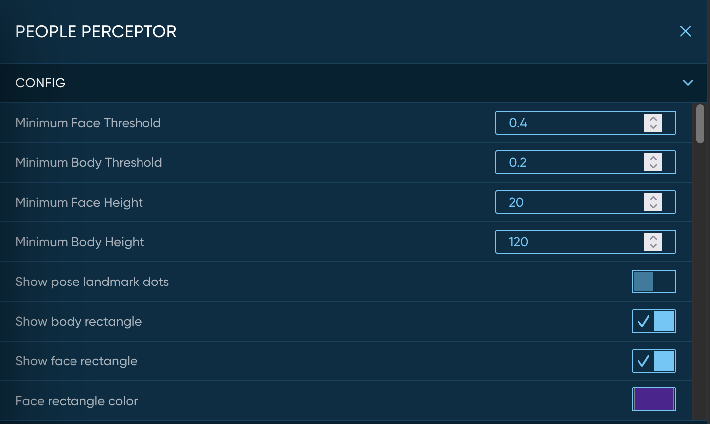
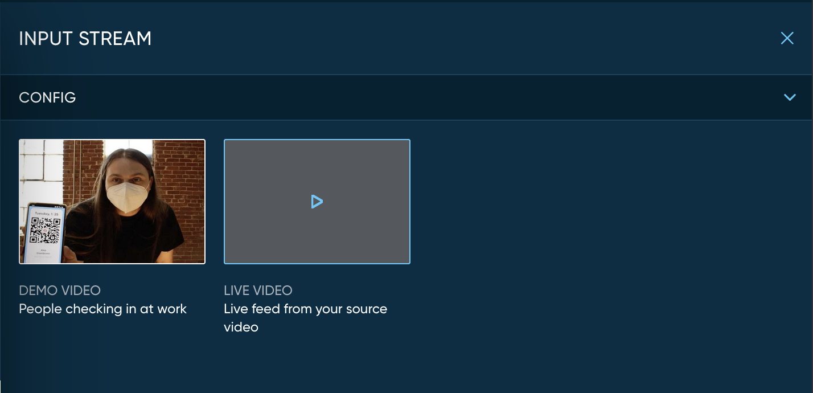

# Darcy AI Explorer

The Darcy AI Explorer application is a sample application and also much more. It serves as an example of how to build a rich application using the Darcy AI SDK that is suitable for production deployment. The Darcy AI platform introduces some novel AI programming concepts. The Darcy AI Explorer application showcases those concepts and allows you to explore them deeply while the app is running. After spending some time with this application, you will have a good understanding of what the Darcy AI platform can do and how you can design and build your own applications.

## Requirements

You will need some hardware to run the Darcy AI Explorer application. Darcy can generally run on any device or computer with a Google Coral AI accelerator. Darcy AI applications are packaged into Docker containers, so the operating system can be Linux, Mac OS X, or Windows provided that the Docker container runtime is installed.

- ARM or x86 CPU (two or more cores recommended)
- Google Coral AI accelerator (more than one Coral increases performance for many applications)
- 512MB of RAM (4GB or more recommended)
- Camera (required for using Darcy with live video)
- Internet connectivity (wired Ethernet or WiFi)
- 200MB available disk space (1GB or more recommended and your application size will vary)
- Docker container runtime

## How to run the application

Use the Darcy AI Explorer Guide document in the Darcy AI SDK to set up your device and deploy the Darcy AI Explorer application. You can find it at the following URI. [https://github.com/darcyai/darcyai-sdk/blob/master/DARCY_EXPLORER.md](https://github.com/darcyai/darcyai-sdk/blob/master/DARCY_EXPLORER.md)

## Video display

The video display area will show either the live video from your attached camera or the looping video file provided with the application. You can use the pause and play controls to stop and start the video playback. The video continues playing as a live stream in order to match the functionality of the recorded video with the experience of the live camera. This means that when you unpause the video the display will jump to the current frame that is running in the background. This is how the live camera operates, so the recorded video follows the same pattern.

The video display area will scale to fit the available width in your browser window and will reduce in size when you open the "inspect" sidebar.

## Inspect sidebar

Click on "inspect" to open the inspection sidebar panel. This area contains a variety of interactive elements that are described in detail below. You can also collapse the inspect sidebar at any time.

## Pipeline

The top section of the screen is a diagram of the Darcy AI pipeline that has been setup for this application. Every Darcy AI application has a pipeline that runs constantly as input data arrives. In this case the input data is video. The Darcy AI pipeline is a powerful concept that allows you to run multiple AI models in a sequence that you specify. The AI processing is applied to every frame of video that passes through the pipeline.

The pipeline section of the application is interactive. You can hover over the different parts of the pipeline to see what they are called. When you click on a section, the information and options for that section appear in the inspect sidebar.

Every Darcy AI pipeline begins with an input stream. This is the place where data arrives into the Darcy AI system. It can be any source of data, such as video, audio, streams of sensor information, or even stock market prices!

The middle section of the pipeline contains Perceptors. A Perceptor is a new concept that is only available with Darcy AI. It is a combination of an AI model and some supporting code that makes the AI processing more reliable and easy to use. A very powerful example of a Perceptor is the "People Perceptor" that is running in the Darcy AI Explorer app. By wrapping the raw AI processing with supporting code, the People Perceptor reduces the errors that usually occur when directly processing a single frame. The result is a much more stable view of the people in the scene, which is a form of AI perception.

Perceptors are designed to remove the complexity from building real-time AI applications. Try clicking on each one to learn more about the AI processing that is happening in the pipeline.

After all of the Perceptor steps are completed in each pipeline cycle, the "Output Callback" step is executed. This is a place in the pipeline where the business logic code of your application is run. The output callback section exists to provide a well-structured place to work with the results of the pipeline AI processing before moving on to the next section.

The "Output Stream" step is executed at the end of each pipeline cycle. The Darcy AI platform allows you to add as many output streams as you like to your application. This gives you the flexibility to use your output data in multiple ways while keeping your code modular. A very popular output stream is the live video feed. This output stream is included with the Darcy AI platform so you don't have to build one. You can create your own output streams for specific business purposes such as sending data to your cloud backend or saving information to a local file. 

## Configuration

The top portion of the inspect sidebar is the "config" section. In this section you will see different configuration options for each of the pipeline items. Try clicking on different pipeline items so you can see the variety of configuration options offered.

In the Darcy AI platform, every pipeline item is allowed to publish configuration options and Darcy AI will gather up the config options and turn them into a configuration REST API that is available while the application is running. While you explore the configuration options in the inspect sidebar, you are interacting with the Darcy AI configuration API in real time.

This portion of the Darcy AI Explorer application shows how easy it is for you to make edge AI applications that provide configuration options while the app is running!

## Video input selector

The video input selector is found under the "config" section when the "input stream" pipeline item is selected. Use the video input selector to choose between the recorded looping sample video or your own live camera. When you change which video source you are displaying, the Darcy AI Explorer application will take a moment to start the new video source. When you are watching the recorded video, the AI results are being computed in real time. This means that you can get the same AI processing applied to your own live camera feed. Change to the live camera video source and see how the AI is applied to the video in real time!

## Events

sdfsdf

## Perception Object Model (POM)

sdfsdf

## Code

sdfsdf

## Developer docs

Use this link to view the Darcy AI developer documentation in your web browser.

## Darcy AI SDK

Follow this link to access the Darcy AI SDK on Github. The SDK contains example code, developer guides, and technical documentation for building your own Darcy AI applications. [https://github.com/darcyai/darcyai-sdk](https://github.com/darcyai/darcyai-sdk)

## Next steps

Now that you have used the Darcy AI Explorer application to learn what Darcy AI can do, get started building your own application! Start with the Darcy AI SDK, which will take you through the steps needed to build and deploy your first application. [https://github.com/darcyai/darcyai-sdk](https://github.com/darcyai/darcyai-sdk)